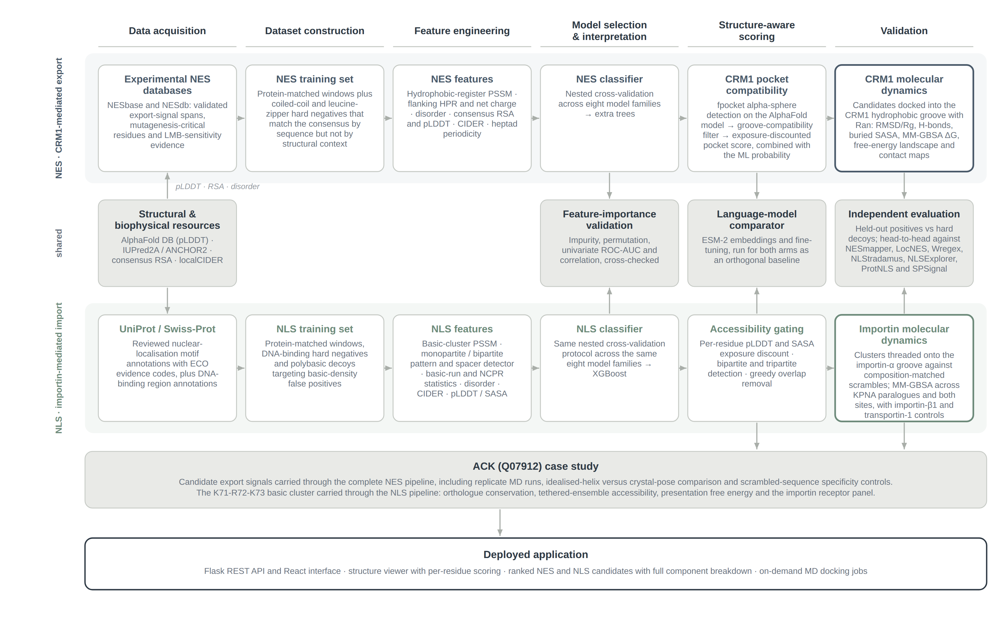

# Nuclear transport signal prediction: NES, NLS and the ACK case study

> **This repository accompanies an MPhil thesis.** It is a research artefact,
> published for transparency and reproducibility, not a maintained tool or a
> hosted service. The predictors here were built and evaluated for the
> specific analyses described below; they have not been benchmarked for
> general-purpose use on arbitrary proteins, and no support or ongoing
> development is offered. If you need a nuclear localisation or export signal
> predictor for your own work, use one of the established published tools.

Machine-learning prediction of nuclear transport signals, validated against
protein structure rather than sequence alone.

Two signal types are covered. **Nuclear export signals (NES)** are short
hydrophobic motifs read by the exportin CRM1/XPO1. **Nuclear localization
signals (NLS)** are basic-residue clusters read by the ARM-repeat grooves of
importin-alpha. Both are notoriously easy to over-predict: the consensus
patterns are short and degenerate, so sequence matching alone fires on large
numbers of hydrophobic patches and basic stretches that are not transport
signals at all.

The approach here is to treat the structural context as part of the
prediction. Candidates are scored by a classifier trained on experimentally
validated signals with deliberately hard negatives, then filtered by whether
the motif is actually solvent-exposed in the AlphaFold model, whether it is
compatible with the receptor's binding groove, and -- for shortlisted
candidates -- whether it stays bound in explicit molecular dynamics. Every
structural scoring term was tested empirically before being given a weight.

The whole pipeline is then applied to human **ACK** (UniProt Q07912),
a non-receptor tyrosine kinase whose nucleocytoplasmic shuttling is not well
characterised, including MM-GBSA binding energetics of its candidate NLS
against individual import receptors.



*The two arms share their structural and biophysical resources, their
feature-importance validation, their language-model baseline and their
independent evaluation, but differ in the biology they encode: a
hydrophobic-register PSSM and CRM1 docking for export, a basic-cluster PSSM
and importin-alpha threading for import.*

---

## What is in this repository

Everything needed to reproduce both pipelines end to end: source code,
training datasets, trained model files and the cleaned reference structures.

Generated outputs are **not** committed -- no results files, figures,
trajectories or reports. The scripts write those into the repository root
when run. This keeps the repository a description of the method rather than
a snapshot of one particular run.

| Path | Contents |
| --- | --- |
| `nes_ml_predictor_improved.py` | NES predictor: PSSM, biophysical features, nested-CV model selection |
| `nls_ml_predictor.py` | NLS predictor: basic-cluster PSSM, bipartite detection, whole-protein scan |
| `pocket_detector.py` | fpocket cavity detection and CRM1 groove-compatibility scoring |
| `consensus_accessibility.py` | consensus relative solvent accessibility from AlphaFold models |
| `quick_helix_analysis.py` | helix propensity and amphipathicity for candidate peptides |
| `md_refinement.py` | OpenMM docking and MD refinement in the CRM1 Cys528 groove |
| `app.py` | Flask JSON API composing the above into the full scoring pipeline |
| `frontend/` | React interface: protein search, structure viewer, ranked candidates, MD jobs |
| `nes_data_pipeline/` | NESbase and NESdb parsing, dataset assembly, structural and CIDER features |
| `nls_data_pipeline/` | UniProt NLS scraping, hard-negative assembly, structural features |
| `nes_negatives/`, `nes_negatives_leucine_zipper_expansion/` | coiled-coil and leucine-zipper hard negatives |
| `models/`, `models_nls/` | trained classifiers, scalers, PSSMs, metrics, feature-importance reports |
| `crm1_reference/` | cleaned CRM1-RanGTP reference structures and extracted NES peptides |
| `ack1_nls_af3/` | ACK NLS register analysis, template geometry, helix and presentation cost |
| `ack1_importin_gpu/` | MM-GBSA screen against importin-alpha paralogues and beta-family receptors |
| `esm_*.py`, `nls_esm_finetune.py` | ESM-2 baseline: frozen embeddings, PCA-reduced, fine-tuned |
| `run_*.py` | pipeline runners, holdout benchmarks and the ACK analyses |
| `evaluate_*.py`, `crystal_*.py` | empirical validation of the individual structural scoring terms |
| `docs/` | figures used in this README |

Scripts resolve their inputs relative to the repository root, so run them
from there.

---

## Requirements

**Runs on Linux, or WSL on Windows** -- the structural layer needs fpocket,
which has no Windows build.

Dependencies are managed with conda, since OpenMM, PDBFixer and fpocket are
not installable from PyPI. If you do not have conda in your WSL environment
(a Windows Anaconda install does not count -- it lives on the other side of
the filesystem), install Miniforge first:

```bash
curl -fsSL "https://github.com/conda-forge/miniforge/releases/latest/download/Miniforge3-Linux-x86_64.sh" -o /tmp/miniforge.sh
bash /tmp/miniforge.sh -b -p $HOME/miniforge3
$HOME/miniforge3/bin/conda init bash
```

Then close and reopen the shell.

## Installation

```bash
git clone https://github.com/OliviaBG/Olivia-BG-MPhil-Thesis-Code.git
cd Olivia-BG-MPhil-Thesis-Code

conda create -y -n nesnls -c conda-forge python=3.11 openmm pdbfixer mdtraj fpocket
conda activate nesnls
pip install -r requirements.txt
```

Verify the two non-PyPI components before trusting a structural run:

```bash
python -m openmm.testInstallation
fpocket -h
```

Both fpocket and mdtraj are installed by the `conda create` line above, so a
fresh environment has everything the pipeline needs.

`mdtraj` is a soft dependency in the code rather than an optional install:
if it is ever absent, `md_refinement.py` still runs and simply omits the
DSSP and buried-SASA metrics. fpocket behaves differently, which is what the
warning below is about.

If you are not using conda, fpocket is also packaged by the system package
managers: `sudo apt-get install fpocket` on Linux and WSL, `brew install
fpocket` on macOS.

If fpocket is missing, `pocket_detector.py` falls back to geometry-based
pocket scoring rather than failing, so a run completes normally and the CRM1
compatibility numbers quietly stop matching the ones reported here. This is
the failure mode to watch for on Windows, where OpenMM installs cleanly and
fpocket cannot.

**Network access.** Dataset construction and the structural backfills query
`rest.uniprot.org`, `alphafold.ebi.ac.uk`, `files.rcsb.org` and
`iupred2a.elte.hu`. Each network-dependent script says so in its docstring
and caches per accession, so interrupted runs resume cleanly. Prediction
using the committed models needs no network.

**Hardware.** The classifiers train on a laptop in minutes. MD refinement
and the MM-GBSA screens want a CUDA GPU: the default importin screen is
4 paralogues x 2 sites x 17 peptides x 3 seeds = 408 MD runs.
`ack1_importin_gpu/` includes deployment scripts for rented GPU nodes.

---

## Quickstart

The trained models are committed, so predictions work immediately without
retraining or any network access:

```bash
# scan a sequence for NLS candidates
python nls_ml_predictor.py predict PKKKRKV
```

```python
# scan a whole protein for NES candidates
from nes_ml_predictor_improved import ImprovedNESPredictor

sequence = "MSNEL..."                       # your protein, single-letter codes
hits = ImprovedNESPredictor().predict_protein(sequence)
for h in hits:
    print(h["start"], h["end"], h["sequence"], round(h["probability"], 3))
```

```python
# same, for NLS
from nls_ml_predictor import NLSPredictor
NLSPredictor().scan_sequence(sequence)
```

> **Passing context matters.** The single strongest learned NES feature is
> the disorder of the C-terminal flanking region. Calling `predict()` on a
> bare peptide with no `full_sequence` and `nes_start` leaves that feature at
> a neutral default, which the model reads as strongly negative -- a real NES
> can score ~0.11 bare and ~1.0 with its true flanking context. Use
> `predict_protein()`, or pass `full_sequence` and `nes_start` explicitly.

### The full pipeline

`app.py` is the complete scoring pipeline, not merely a web front end: it
composes the classifier with the accessibility, pocket-compatibility and MD
terms. The command-line runners drive it through Flask's test client, so
they exercise exactly the same code path as the served application.

```bash
python app.py                        # Flask API on :5000
python run_full_pipeline_cli.py      # the same pipeline for one protein, from the terminal
```

This route additionally needs fpocket, OpenMM and network access.

---

## Running the interface

The application is two processes. `app.py` serves JSON on port 5000; the
React interface in `frontend/` serves the UI on port 3000 and calls that
API. Both must be running, in two separate shells.

### One-time setup

From the repository root:

```bash
cd frontend
npm install
```

Node 18 or newer is required. `npm install` takes several minutes and prints
a long list of `npm warn deprecated` lines -- those are normal for
`react-scripts`, not errors. Let it run to completion; the prompt returns
with a line like `added 1487 packages`. If you interrupt it, `npm start`
will fail with `react-scripts: not found`, and you simply run `npm install`
again.

Afterwards npm may report vulnerabilities and suggest `npm audit fix
--force`. Do not run it -- it upgrades `react-scripts` past a major version
and breaks the build. The warnings concern the build toolchain, not shipped
code.

(Under WSL, keeping the repository on the Windows filesystem makes
`npm install` noticeably slower, because every file access crosses the
boundary. It works; it is just not quick.)

### Each time you run it

Shell 1, the API, from the repository root:

```bash
cd /path/to/Olivia-BG-MPhil-Thesis-Code
conda activate nesnls
python app.py
```

Shell 2, the interface, from the `frontend` subfolder:

```bash
cd /path/to/Olivia-BG-MPhil-Thesis-Code/frontend
npm start
```

`conda activate` is only needed in shell 1; npm does not use the Python
environment.

`npm start` opens `http://localhost:3000` in your browser. If the page loads
but every request fails, shell 1 is not running.

The interface reads the API at `http://localhost:5000/api`, set as
`API_BASE` at the top of `frontend/src/App.jsx`, and `app.py` already
permits browser requests from `localhost:3000`. The default ports therefore
work with no configuration; change both if you need to run elsewhere.

From there you get UniProt/AlphaFold protein search, the structure viewer
with per-residue scoring, ranked NES and NLS candidates with the full
component breakdown behind each score, and on-demand MD docking jobs.

There is no hosted public instance: the pipeline needs fpocket, OpenMM and a
GPU for the MD stages, so it is run locally rather than as a web service.

---

## NES pipeline

**Data acquisition.** `nes_data_pipeline/nesbase_parser.py` parses
NESbase 1.0; `nesdb_scraper.py` (or `parse_nesdb_cache.py`, for cached
pages) parses NESdb. `build_dataset.py` merges both into `nes_dataset.csv`
and `.json`, one row per experimentally defined export-signal span.

**Dataset construction.** The negatives are the point. Random sequence
decoys are trivially separable and inflate apparent performance, so
`negative_dataset_builder.py` pulls UniProt coiled-coil and leucine-zipper
regions whose hydrophobic spacing matches the NES consensus but whose
structural context rules them out, and `expand_leucine_zipper_negatives.py`
extends that pool. Protein-matched decoys -- real windows from the same
protein, outside the annotated NES -- are generated at training time.

**Feature engineering.** A hydrophobic-register PSSM, flanking hydrophobic
and net-charge terms, disorder, consensus RSA and pLDDT, linear CIDER
charge and hydropathy profiles, and heptad periodicity.
`nes_data_pipeline/structural_dataset_v2_pipeline.py` backfills per-residue
pLDDT and SASA from AlphaFold; `fetch_iupred_training_data.py --pipeline nes`
backfills IUPred2A disorder and ANCHOR2 scores.

**Model selection.** Nested cross-validation across eight model families, so
the reported estimate comes from outer folds rather than a single held-out
slice. `compare_split_methodology.py` documents why: the earlier single-split
number was itself noisy run to run.

```python
from nes_ml_predictor_improved import ImprovedNESPredictor
ImprovedNESPredictor()._train_model()      # retrains and overwrites models/
```

**Validation.** `run_holdout_pipeline_test.py` scores an independently
sourced holdout set through the live pipeline.

---

## NLS pipeline

Built on the same methodology but different biology. Classical NLS
recognition is by the ARM-repeat grooves of importin-alpha rather than one
hydrophobic groove, so the PSSM is anchored on the basic-cluster register
and a bipartite spacer detector is added as its own feature family.

The hard negatives target the documented failure mode of NLS predictors that
lean on basic-residue density: real UniProt-annotated DNA-binding regions,
which are genuinely basic, genuinely functional and not import signals, plus
shuffled polybasic decoys.

```bash
python nls_data_pipeline/uniprot_nls_scraper.py     # positives from Swiss-Prot
python nls_data_pipeline/build_dataset.py           # assemble the CSVs
bash run_full_nls_retrain_pipeline.sh               # backfill, train, benchmark
```

`run_full_nls_retrain_pipeline.sh` runs structural backfill, disorder
backfill, full nested-CV training and the 25+25 held-out benchmark in order,
and is resumable. `nls_ml_predictor.py train` is the direct training entry
point.

---

## Structural scoring layer

Three structural terms sit on top of the sequence classifier: consensus
relative solvent accessibility of the anchor residues, CRM1 pocket
compatibility, and explicit MD docking for shortlisted candidates.

None of the weights are guesses. Each term was tested on real positives
against hard negatives before being given one:

- `evaluate_crm1_pocket_signal.py` tests whether fpocket cavity
  compatibility and raw hydrophobic burial actually separate real NES motifs
  from hard negatives; `compute_crm1_joint_weights.py` derives the blend
  weights from that result.
- `evaluate_anchor_occupancy_signal.py` does the same for the Phi-anchor to
  sub-pocket occupancy metric.
- `crystal_sanity_check.py`, `crystal_full_grid_check.py` and
  `idealized_helix_vs_crystal_check.py` check the docking protocol against
  crystallographic NES-CRM1 complexes -- including HIV-1 Rev, where the real
  bound conformation is extended rather than helical and forcing an
  idealised helix converges 8-15 A from the true pose.

`crm1_reference/` holds cleaned chain A + chain C (CRM1 + RanGTP) references
and extracted NES peptides for PDB entries 3NBY, 3NBZ, 3NC0, 3GB8, 3GJX,
5DHF, 5DIF, 5UWH, 5UWS and 5UWU. The raw RCSB downloads are not committed;
re-fetch with `setup_crm1_reference.py` and rebuild with
`extract_crystal_references.py` and `build_clean_crystal_references.py`.

---

## ACK case study

```bash
python run_ack1_full_pipeline_scan.py      # whole-protein NES + NLS scan of Q07912
python run_ack1_md_refinement.py           # MD refinement of shortlisted NES candidates
python run_ack1_replicate_study.py         # independent replicates of the top candidate
python run_ack1_rank1_50ns.py              # 50 ns production trajectory
python run_ack1_md_specificity_control.py  # scrambled-sequence control
```

`ack1_nls_af3/` holds the sequence-level NLS analysis that needs no force
field: `thread_ack1.py` maps the ACK basic clusters onto the
crystallographic cNLS register from 3UL1 and 1EJL and reports which
importin-alpha pockets can be satisfied; `template_geometry.py`,
`helix_cost.py` and `presentation_cost.py` quantify what presenting the
signal would cost the folded SAM domain; `dimer_importin_clash.py` tests the
SAM dimer for steric occlusion.

`thread_ack1.py` and `template_geometry.py` read `ack1.fasta` from the
working directory:

```bash
curl -o ack1.fasta https://rest.uniprot.org/uniprotkb/Q07912.fasta
```

---

## Receptor-resolved NLS energetics

`ack1_importin_gpu/` asks which import receptor, rather than treating
nuclear import as one pathway. For every combination of paralogue, binding
site and peptide, the test peptide is threaded onto the crystallographic NLS
in that site, the receptor first shell is mutated to the paralogue, side
chains are rebuilt, restrained MD is run in Amber14/GBn2 implicit solvent,
and the pose is scored by ensemble MM-GBSA over the trajectory. The van der
Waals, Coulomb, polar solvation and nonpolar components are reported
separately so the electrostatic contribution stays visible.

```bash
cd ack1_importin_gpu
python ack1_importin_gpu.py --stage pockets   # map importin-alpha pockets, KPNA1-4 first shells
python ack1_importin_gpu.py --stage screen    # the MM-GBSA screen (GPU)
python ack1_importin_gpu.py --stage tether    # can the folded SAM domain be accommodated at all
python ack1_importin_gpu.py --stage analyse   # ranking, controls, charge-bias regression
python beta_screen.py                         # same method, beta-family receptors
python analyse_beta.py
```

**One input is not distributed here.** `sam_dimer_fixed.pdb`, the ACK SAM
dimer structure, is unpublished and deliberately excluded from this
repository. The code is unchanged and still expects it, so without it:

- `ack1_importin_gpu.py --stage tether` will not run -- this is the analysis
  of whether the folded SAM domain can be accommodated in the groove at all.
- `ack1_nls_af3/helix_cost.py` will not run.
- The pod deployment scripts (`deploy_to_pod.sh`, `one_pod.sh`, `pods.sh`,
  `pod_bootstrap.sh`, `alpha_topup_pod.sh`) list it among the files they copy
  and will report it missing. `deploy_to_pod.sh` checks for it up front and
  stops.
- `pod_bootstrap.sh` runs the `tether` stage on the pod as part of its
  sequence, so that step fails there too.

The `pockets`, `screen` and `analyse` stages never read it, so the MM-GBSA
screen itself -- the main result of this sub-pipeline -- reproduces fully
without it. To run the affected steps, supply your own SAM dimer coordinates
under that filename, or remove it from the file lists in the deployment
scripts.

Absolute binding free energies are **not** comparable between receptors --
templates, interface areas and burial all differ, so a receptor with a
larger groove flatters every peptide. The analysis therefore uses each
receptor's own internal contrast against composition-matched scrambled
controls. `README_ack1_importin.md` documents the receptor panel, templates
and GPU deployment. No AlphaFold model is used anywhere in this
sub-pipeline.

---

## Language-model baseline

So that the hand-engineered feature set is measured against a modern
sequence representation on identical folds, rather than asserted to be
better.

```bash
python esm_embed_sequences.py     # frozen ESM-2 150M embeddings for every training sequence
python esm_full_comparison.py     # 5-fold CV: hand-engineered vs frozen vs PCA vs combined
python esm_finetune_kfold.py      # same folds, fine-tuned ESM-2
python esm_umap_agreement.py      # rank agreement and embedding-space structure
python esm_comparison_figures.py
```

---

## Comparison against published tools

`nes_holdout_set_12seq.fasta` is the holdout set used for head-to-head
comparison. The third-party predictors themselves -- NESmapper, LocNES,
Wregex, NoLogo, NLStradamus, NLSExplorer, ProtNLS and SPSignal -- are **not**
redistributed here, as they carry their own licences. Obtain them from their
authors and score the same FASTA to reproduce the comparison.

---

## Data provenance

Training data derives from public sources under their own terms: NESbase 1.0
and NESdb for validated export signals, UniProt/Swiss-Prot reviewed entries
for NLS motif and DNA-binding annotations, the AlphaFold Protein Structure
Database for models, IUPred2A/ANCHOR2 for disorder, and the RCSB PDB for
crystal structures. Cite those sources directly if you use the derived
datasets. IUPred2A in particular requires an academic licence agreement and
is not redistributed here.

Synthetic decoy sequences in the negative sets are labelled as such;
`resolve_taxonomic_provenance.py` reports, per row, which entries have a real
source accession and which are generated.

---

## Reproducibility notes

- Random seeds are fixed where results depend on them. MD trajectories are
  stochastic by nature, which is why the ACK analysis reports replicates
  rather than a single run.
- The committed model files correspond to the committed datasets, so
  predictions reproduce without retraining.
- Network-dependent stages cache per accession and are safe to interrupt.

## Licence

No licence has been chosen yet, which under default copyright means the code
may be read but not reused. If you would like to build on it, please open an
issue or get in touch, and a licence will be added.

## Citation

If this work is useful to you, please cite the associated thesis. A citation
entry will be added here on publication.
